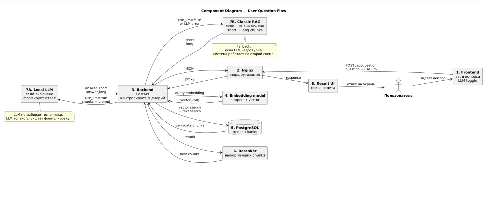

# RAG-система

## 1. Назначение

Система принимает вопрос пользователя на естественном языке и возвращает ответ, сформулированный на основе текстовых фрагментов из заданного исходного документа. Поиск основан на косинусном расстоянии между векторными представлениями (эмбеддингами) вопроса и предварительно индексированных фрагментов (коротких и длинных).  
Дополнительно реализована **локальная LLM**, которая улучшает формулировку ответов (краткий и подробный вариант), переформулирует вопросы тренажёра и пояснения. LLM можно включать/выключать через интерфейс. При выключенной LLM система работает в классическом RAG-режиме (без генерации).


## 2. Общая архитектура

Система состоит из сервисов, оркестрируемых через `docker-compose.yml`:

- **PostgreSQL** с расширением `pgvector` – хранит эмбеддинги фрагментов, а также таблицу вопросов для тренажёра.
- **Bootstrapper** – однократно разбивает исходный текст на чанки, вычисляет эмбеддинги, заполняет БД и генерирует вопросы для тренажёра.
- **Backend** – FastAPI-приложение: принимает вопросы, выполняет поиск, при включённой LLM вызывает локальную модель для генерации ответов; также обслуживает тренажёр.
- **Frontend** – статический HTML/CSS/JS интерфейс с двумя вкладками (ассистент и тренажёр), поддержкой истории чата, настройками LLM.
- **LLM** – отдельный сервис на базе llama-cpp-python, предоставляющий REST API для генерации. При первом запуске автоматически скачивает модель в GGUF-формате.
- **Nginx** – reverse-proxy, обеспечивает маршрутизацию, самоподписанный TLS (порт 8443) и HTTP-редирект.

Все сервисы работают в одной сети `ragnet`.

## 3. Компоненты и их взаимодействие

## Диаграмма архитектуры


### 3.1 PostgreSQL (pgvector)

- Образ: `pgvector/pgvector:pg15`.
- Инициализация: скрипт `postgresql/init.sql` создаёт расширение `vector` и три таблицы:
  - `documents_short` – короткие чанки (используются для точного поиска).
  - `documents_long` – длинные чанки (используются для контекста).
  - `questions` – таблица с вопросами и эталонными ответами для тренажёра.
- Каждая таблица имеет поле `embedding vector(768)` (модель `intfloat/multilingual-e5-base`).
- Созданы индексы `IVFFlat` для ускорения поиска.
- Для полнотекстового поиска добавлено поле `search_vector` (тип `tsvector`).

### 3.2 Bootstrapper

Сервис, выполняющий загрузку и векторизацию исходного текста, а также генерацию вопросов для тренажёра. Логика в `backend/app/bootstrapper.py`.

**Алгоритм:**

1. Проверяет, есть ли данные в таблицах; при `REBUILD_EMBEDDINGS=true` очищает их.
2. Читает `.txt` файлы из каталога `sources/`.
3. Разбивает текст на **короткие чанки** (токенные, размер ~60 токенов) и **длинные чанки** (структурные – по заголовкам разделов).
4. Для каждого чанка вычисляет эмбеддинг с префиксом `"passage: "`.
5. Сохраняет чанки и эмбеддинги в БД.
6. Запускает генерацию вопросов (`question_generator.py`), который выделяет из текста определения и сохраняет их в таблицу `questions` вместе с эмбеддингами эталонных ответов.

### 3.3 Backend (FastAPI)

Основной сервис на Python с использованием `fastapi`, `sentence-transformers`, `psycopg2`, `pgvector` и `llama-cpp-python`.

**Запуск:** `uvicorn app.main:app --host 0.0.0.0 --port 8000`.

**Модели:**
- `intfloat/multilingual-e5-base` для эмбеддингов.
- `CrossEncoder` (mmarco-mMiniLMv2-L12-H384-v1) для переранжирования.
- Локальная LLM (подключается через HTTP к сервису `llm`).

**Эндпоинты:**

| Метод | Путь | Назначение |
|-------|------|-------------|
| POST | `/api/question` | Получить ответ на вопрос ассистента (с поддержкой LLM) |
| GET | `/api/trainer/question` | Получить случайный вопрос для тренажёра (с возможной переформулировкой LLM) |
| POST | `/api/trainer/check` | Проверить ответ пользователя (с улучшением пояснения через LLM) |
| GET | `/api/trainer/questions` | Получить все вопросы тренажёра (ID и текст) |

**Алгоритм обработки запроса `/api/question`:**

1. Валидация осмысленности запроса.
2. Расширение запроса (синонимы, исправление typo).
3. Поиск коротких и длинных чанков в БД с использованием комбинированного ранжирования (вектор + лексика + бонусы за заголовки).
4. Переранжирование с помощью CrossEncoder.
5. Если LLM включена, формируется контекст и отправляется запрос к LLM, которая возвращает **краткий** и **подробный** ответы.
6. Если LLM недоступна или выключена, возвращаются исходные фрагменты (классический RAG).

### 3.4 LLM (локальная)

Отдельный сервис (образ из `llm/Dockerfile.downloader` и `llm/llm_service.py`). При запуске:

- Скачивает GGUF-модель (например, `Qwen2.5-1.5B-Instruct-Q4_K_M.gguf`) в том `llm_models`.
- Запускает llama-cpp-python с REST API (порт 8001).
- Backend обращается к нему по имени контейнера `llm:8001`.

**Модель используется для:**
- Генерации краткого и подробного ответа ассистента.
- Переформулировки вопроса тренажёра (для вариативности).
- Создания пояснений при проверке ответа (более дружелюбный текст).

Fallback: если LLM не отвечает или её включение выключено, backend бесшовно переключается на классический RAG.

### 3.5 Frontend

Статический интерфейс (`frontend/index.html`) с двумя вкладками:

- **Ассистент**: чат с историей, поддержка LLM (кнопка настроек), отображение бейджа "Сформулировано локальной LLM".
- **Тренажёр**: последовательный показ всех вопросов в случайном порядке, навигация (предыдущий/следующий), проверка ответа с улучшенной валидацией (эмбеддинги + пересечение ключевых слов), кнопка сброса прогресса.

**Функции:**
- Переключение LLM сохраняется в `localStorage` и применяется ко всем запросам.
- История чата сохраняется между сессиями.
- Ползунок прокрутки стилизован под цветовую гамму.
- Адаптивный дизайн.

### 3.6 Nginx reverse-proxy

Основной вход. Конфигурация:

- Порт 80 → редирект на HTTPS (301).
- Порт 443 → проксирование `/api/` на `backend:8000`, `/` на `frontend:80`.
- Самоподписанный сертификат генерируется в `entrypoint.sh` с помощью `openssl` (установленного в образе nginx:latest).

## 4. Переменные окружения (файл .env)

- `REBUILD_EMBEDDINGS` – управляет перестроением индексов в bootstrapper.
- `PDF_PATH` – внутри контейнера bootstrapper, указывает на каталог с исходными текстами (монтируется `./sources:/app/sources`).
- `DATABASE_URL` – используется и backend, и bootstrapper.
- `POSTGRES_*` – параметры для сервиса postgres.

## 5. Запуск и развёртывание

### Требования
- Docker и Docker Compose (версия не ниже 2.0).
- Исходный файл учебника должен лежать в каталоге `sources/DM2024_module9.txt` (или другой `.txt`, система возьмёт все файлы в этом каталоге).

### Шаги

1. Клонировать репозиторий проекта.
2. Убедиться, что в каталоге `sources/` присутствует хотя бы один `.txt` файл.
3. При необходимости изменить переменные в `.env` (например, пароль БД).
4. Выполнить:
   ```bash
   docker-compose up --build
   ```
5. Дождаться, пока система запустится (в логах появится `Application startup complete.` и `BOOTSTRAPPER DONE`).
6. Открыть в браузере: `https://localhost:8443` (принять самоподписанный сертификат). HTTP-порт 8080 также доступен, но будет редиректить на HTTPS.

#### Примечание
Если возникают проблемы с nginx, то перейдите в директорию nginx и в терминале выполните:
```
sed -i 's/\r$//' entrypoint.sh
```

### Примечания по запуску

- Bootstrapper запускается параллельно с backend. Если backend начнёт принимать запросы раньше, чем bootstrapper заполнит БД, ответы будут содержать пустые списки. Для production рекомендуется добавить `depends_on` с условием готовности bootstrapper или использовать `healthcheck` в bootstrapper (не реализовано). В текущей версии bootstrapper запускается однократно и завершается; для перезапуска используйте `docker-compose up --force-recreate bootstrapper` или установите `REBUILD_EMBEDDINGS=true`.
- Модель `intfloat/multilingual-e5-base` весит около 1.1 ГБ и будет загружена при первом запуске backend и bootstrapper. При первом запуске LLM скачает модель (около 2 ГБ). Кэш сохраняется в томе `backend_cache`, поэтому повторные запуски быстрее.

## 7. Структура файлов

```
.
├── .env
├── parsing.py
├── docker-compose.yml
├── backend/
│   ├── Dockerfile
│   ├── requirements.txt
│   └── app/
│       ├── __init__.py
│       ├── bootstrapper.py
│       ├── chunking.py
│       ├── main.py
│       ├── llm.py
│       ├── fix_text.py
│       ├── question_generator.py
│       ├── schemas/
│       │   ├── __init__.py
│       │   └── users.py
│       └── sources/
│           ├── DM2024_module9.txt
│           └── architecture.png
├── frontend/
│   ├── Dockerfile
│   ├── index.html
│   └── nginx.conf
├── llm/
│   ├── Dockerfile.downloader
│   └── download_model.py
├── nginx/
│   ├── Dockerfile
│   ├── entrypoint.sh
│   └── nginx.conf
└── postgresql/
    └── init.sql
```